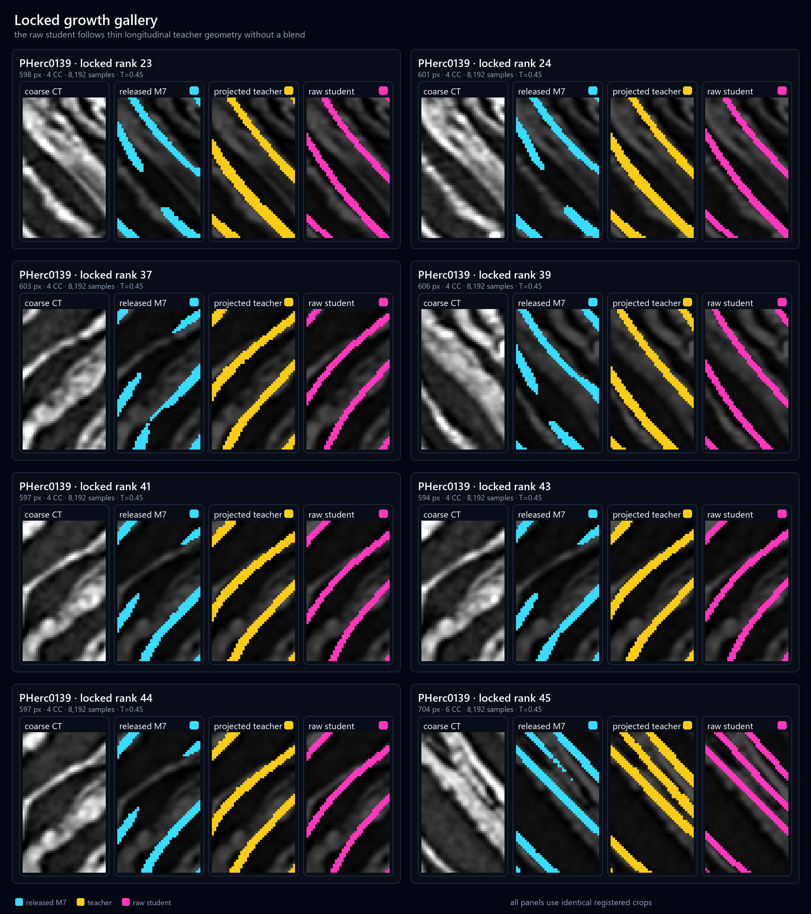
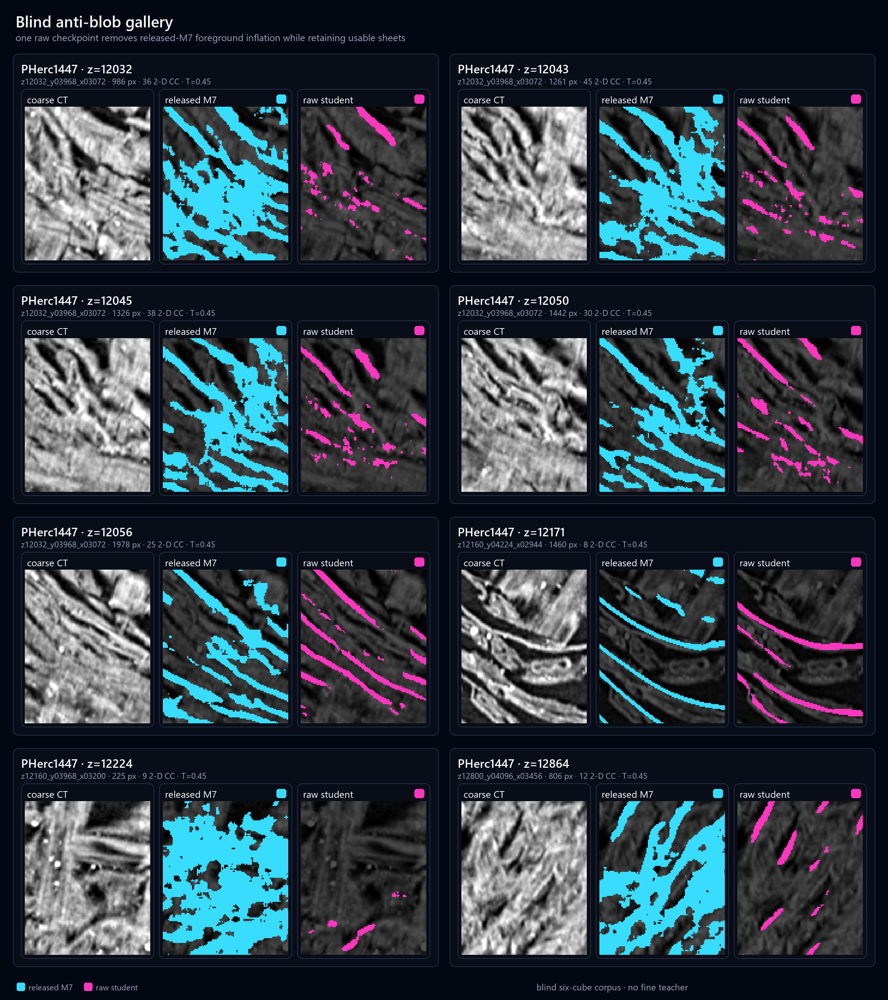

# The Socratic Method

## Cross-resolution teacher supervision and topology-aware repair for papyrus surface segmentation

**Authors:** to be confirmed 
**Affiliations:** to be confirmed 
**Status:** working draft, September 2026 
**Repository:** <https://github.com/ubc-nvining/socratic_method>

### Abstract

Coarse-resolution papyrus surface segmentation fails in two opposing ways:
faint sheets disappear, while nearby wraps merge into blobs. We study a
teacher-student recipe in which an approximately 2.399 um native-fine Villa
model interrogates the released 9.362 um M7 segmenter. The resulting student is
still an ordinary, single M7 residual-encoder nnU-Net at inference. During
training, projected soft occupancy is combined with medial-crest recall,
teacher-background separation, M7 function preservation, a global parameter
trust region, and dynamic widest-path connectivity. A separate additive 2D
line fitter reconnects short, geometrically credible gaps after segmentation.
The completed v31 duration ladder shows positive held-out per-scroll gains over
M7 at all eight measured milestones. The best calibrated macro-scroll Dice,
0.58293, occurs at 7,168 samples; the 8,192-sample result is 0.58037.
The ordinary Dice calibration remains censored at the lower boundary, but an
independent registered-morphology and blind anti-blob review selects the raw
8,192-sample checkpoint at threshold 0.45. It passes the six-cube PHerc1447
anti-blob gate and matches teacher component count on 15 of 16 locked PHerc0139
slices; the remaining scalar exception is documented.

### 1. Introduction

The objects behind this work are the Herculaneum papyri, a library of scrolls
carbonized by the AD 79 eruption of Mount Vesuvius. The rolls survive but are too
brittle to open, leaving their writing trapped inside tightly wound coils.
Synchrotron micro-CT records the internal structure without touching the object;
recovering a page then requires locating the papyrus sheet in three dimensions
and virtually unwrapping it to a plane. One scroll is a single sheet, metres
long, visiting many adjacent turns, so pieces that are close in CT may be far
apart on the page.

Segmentation is the first geometric commitment in a scroll-unwrapping pipeline.
A missed surface interrupts a sheet that may otherwise be traceable over a long
distance. An overgrown prediction is at least as dangerous: it can weld nearby
turns of the scroll into one component and make a locally plausible surface
globally wrong. A useful training procedure must therefore grow real faint
structure and remove false material at the same time. A single overlap score
does not express that tension particularly well.

The Vesuvius Challenge provides another source of information. A model operating
on finer CT can resolve local evidence that is ambiguous after downsampling, but
the deployed segmentation and geometry stack still consumes the coarser grid.
This suggests a cross-resolution dialogue. The fine model proposes a soft
occupancy and a medial explanation; the coarse M7 model contributes the function
that already works; explicit losses expose where those views are inconsistent.
The student must reconcile them while remaining inside a small parameter-space
neighborhood of released M7.

This is the origin of the name. In the quoted description of Socrates, a speaker
who professes little knowledge reveals inconsistencies in an expert's account
and thereby points toward a better one. Here the fine teacher is not deployed as
a superior replacement. It asks local questions of the expert coarse model.
The answer is a revised M7 architecture that stands alone at inference.

> “I neither know nor think that I know.” — Socrates, in Plato's *Apology* 21d
>
> **SOCRATES:** I am wiser than this man; he fancies he knows something,
> although he knows nothing— 
> **DARRYL, SOCRATES' FRIEND:** *fuck him up socrates* 
> — leon (@leyawn), April 8, 2015

Our contributions are:

1. a hash-pinned and machine-executable 2 um-to-9 um supervision recipe;
2. an objective that combines soft occupancy, de-blob separation, medial recall,
   dynamic connectivity, and two forms of M7 preservation;
3. a duration-ladder protocol that retains every declared milestone rather than
   assuming the longest run is best; and
4. an independently measured additive 2D postprocess that reconnects only short
   gaps passing geometric and cross-plane objections.

> **Figure 1 - method overview.** File:
> `figures/figure_1_method_overview.png`. It shows the released M7 baseline,
> 2.399 um Villa teacher, projection into the 9.362 um frame, student loss terms
> and trust region, then the raw student-only inference boundary and separate
> 2D fitter.

### 2. Cross-resolution student

#### 2.1 Architecture and initialization

The student is a six-stage 3D residual-encoder nnU-Net with feature counts 32,
64, 128, 256, 320, and 320. It accepts one CT channel and predicts background
and surface logits. The network has 102,349,770 trainable parameters. Every
parameter is retrained, but initialization is accepted only when the released
M7 checkpoint has SHA-256
`17465b77591b794638e671f1a9f79c4cf1e79821f302e6fc235e3725e5da7d7e`.
The check is fail-closed and includes the original segmentation heads.

The fine teacher is used in corpus construction, not inference. The deployed
network consumes a coarse CT block and emits the raw student's logits. There is
no fine-teacher forward pass and no probability blend with M7 at deployment.
This boundary matters both scientifically and operationally: an improvement
cannot be attributed to an unreported ensemble, and inference retains the
ordinary M7 memory and integration shape.

#### 2.2 Projected supervision

Native-fine teacher predictions are pulled back to the coarse grid as soft
occupancy rather than reduced to a binary vote. This preserves partial-volume
evidence at a sheet boundary. Independent validity fields identify where the
teacher is defined. A medial-crest projection marks thin centerline evidence
without thickening it into a tube. This split came from an observed failure of
occupancy-only supervision: a real continuation may fill only 25--45% of a
coarse voxel, so cross-entropy correctly settles below a usable binary decision
threshold. Weakening the surrounding background pressure recovered growth but
also restored blobs and short welds. We therefore use occupancy to encode
*amount of material* and a binary crest to encode *sheet existence*.

The crest uses the center--radius view of [LSMAT](https://doi.org/10.1111/cgf.13599),
while retaining the released Villa center extraction rather than claiming to
run LSMAT's continuous optimizer. Each native-fine z slice is skeletonized in
2D; the stacked centers receive one 3D closing and are intersected with the
teacher foreground. A physical 2D Euclidean distance transform supplies a
radius for each center, and open disks reconstruct the teacher support.
Using a 3D distance transform here would replace those slice-wise disks with
spheres and collapse the medial surface that represents a papyrus sheet. The
center coordinate supplies axial evidence for continuation, while the radius
coordinate explains radial thickness. Only the centers are max-projected to a
binary coarse crest; reconstructed occupancy remains a soft anti-aliased
pullback.

The active training manifest has 4,096 deterministic rows from PHerc0139 and a
single record,
`pherc0139-native-fine-teacher-2p399-to-9p362-v11p1`. An inherited field in the
original v31 recipe listed four training scrolls; inspection of every row in the
SHA-pinned manifest showed that this was stale metadata. The executable recipe
follows the actual PHerc0139-only bytes, and the inconsistent source document is
retained verbatim for auditability.

#### 2.3 Loss

The objective has complementary growth, separation, connectivity, and
preservation terms. Soft cross-entropy has weight 1.0 and soft Dice has weight
0.25. For the valid crest set `C`, per-sample medial recall is
`1 - (sum_C p + 1) / (|C| + 1)` with weight 1.0. It is averaged over
crest-bearing samples, not all voxels, so sparse axial evidence cannot vanish
into the background count.

The separation loss constructs a thin positive seed from the crest, falling
back to `q >= 0.5` only where crest validity is absent. It dilates that seed by
two voxels, subtracts the seed itself, and intersects the resulting shell with
valid, confidently empty teacher space (`q <= 0.1`). Mean background
cross-entropy on this shell has weight 2.0. This is a local fence around
teacher-supported medial structure, rather than a generic background penalty:
it attacks unsupported girth and short cross-wrap welds while leaving the
occupancy and crest terms free to grow faint material elsewhere.

M7 contributes two functional constraints. A KL term of weight 0.5 anchors M7
in unknown space except inside a radius-two corridor around teacher positives.
In known space it acts only on confident hard agreement between M7 and the
teacher; ambiguous partial occupancy is not silently counted as background
agreement. The KL direction is `KL(Ber(p_M7) || Ber(p_student))`. A separate
one-sided foreground cross-entropy of weight 1.0 protects M7 positives inside
the radius-two teacher corridor at anchor threshold 0.5. The current recipe
deliberately has no soft preservation floor, allowing the fine teacher's
partial-volume growth band to move while retaining harder incumbent structure.

Connectivity events are built only when a thin teacher component bridges at
least two disconnected M7 components. The pins are the component-contact sets,
not arbitrary student endpoints. The permitted corridor is the smallest
zero-to-three-voxel dilation of the projected LSMAT-style centers that connects
those pins inside the teacher component. Validity, thickness, erosion-survival,
missing-voxel, and tile-ownership screens make the construction conservative.

Our precursor fixed a minimum-off-axis spanning-tree route through each such
corridor and raised its weakest 10% of logits toward probability 0.2. It showed
that center-biased continuation could be supervised, but larger weights damaged
validation and the chosen route was arbitrary. The current dynamic loss keeps
the audited pins and corridor but asks existentially for *some* route. Pins and
nearby M7 anchors have unit capacity, other corridor voxels have student
probability as capacity, and everything outside has zero capacity. Ninety-six
26-neighbor max--min propagation steps compute the widest path from one pin to
the others. An event-balanced hinge penalizes only a bottleneck below 0.2, with
weight 0.03125, so gradients act on the limiting voxels of the current best
route rather than filling the entire corridor.

The training-only atlas contains 149 fully owned events: 135 have two pins, 13
have three, and one has four; 122 need no crest dilation and 27 need one voxel.
Ninety-nine schedule rows encounter at least one event and 477 rows are
eligible. The maximum audited path needs 44 steps, below the configured budget.
Atlas construction used training-manifest boxes only and did not consult
held-out gates. The connectivity term runs only at full resolution; resampling
is not allowed to broaden its medial corridor.

#### 2.4 Optimization and trust region

We train with Adam at a constant learning rate of `2e-5`, betas (0.9, 0.999),
epsilon `1e-8`, and no weight decay. Batch size is three with eight-step gradient
accumulation and bfloat16 autocast. Seed 1203 fixes schedule and augmentation
randomness. Two workers operate under a 16-thread CPU ceiling.

After every optimizer update, the complete student parameter vector is
projected into a relative-L2 ball of radius `0.0027535421730275947` around the
released M7 parameters. This projection is active on essentially every observed
update. The radius is therefore part of the learned method, not merely a dormant
guard. The selected radius came from an earlier objective and should eventually
be re-screened under the present loss.

### 3. Evaluation protocol

The held-out validation manifest contains registered examples from PHerc0814
and PHerc1451. We evaluate every 1,024 cumulative samples and retain model-only
snapshots at 1,024, 2,048, 4,096, and 8,192. The 4,096-row schedule is traversed
twice, but a checkpoint may be selected from any retained or evaluated
milestone. Selection uses calibrated macro-scroll Dice with a minimum per-scroll
gain guard against released M7.

Thresholds are swept from 0.25 through 0.60 in increments of 0.01. Every
milestone selects 0.25, the lower boundary. Those calibrated scores compare
duration within this experiment, but the optimum is censored and 0.25 inflates
foreground on blind PHerc1447. The independent morphology operating point is
therefore 0.45.

Checkpoint promotion is deliberately stricter than held-out Dice. Five
durations and thresholds 0.38--0.50, with 0.25 retained as a failure control,
were evaluated on 16 locked PHerc0139 slices and six blinded PHerc1447 cubes.
The locked locations are evaluation-only and spatially separated from the
PHerc0139 training boxes. The gate includes two-sided morphology and coverage,
false-merger inspection, and human review. An older raw v29 candidate failed the
PHerc1447 anti-blob gate and is retained as a negative result rather than
represented as the model.

> **Figure 2 - registered model examples.** File:
> `figures/figure_2_registered_examples.png`. Locked PHerc0139 rows show aligned
> CT, released M7, projected teacher, selected raw student, and two-sided
> differences in the recovered cyan/yellow/magenta/green visual grammar.

### 4. Completed duration-ladder result

At 1,024 samples, calibrated macro-scroll Dice is 0.57944, a gain of 0.01968
over the M7 initial model. The ladder remains positive but non-monotonic through
all eight intervals. Its best calibrated macro-scroll Dice is 0.58293 at 7,168
samples, with a minimum per-scroll M7 gain of 0.02276. The final 8,192-sample
interval scores 0.58037, with a minimum per-scroll gain of 0.02031. Trust-region
projection is active for 97.7% of updates in the first interval and 100%
thereafter.

The best ordinary-validation row is not automatically the best geometric model,
which validates retaining the ladder. Registered morphology and blind de-blob
review select the raw 8,192-sample checkpoint at threshold 0.45. At this point
15/16 locked slices have exact teacher component counts and all 16 pass the
anti-blob check. On PHerc1447 the foreground ratio is 0.950508 relative to the
v15 comparison, reference recall is 0.911324, no cube has an interior or
thickness regression, and the hard anti-blob gate passes. At 0.42 the machine
component count is 16/16; 0.45 is retained because visual review finds the
cleaner useful-structure/de-blob balance and the lone rank-26 mismatch is a
known topology-accounting ambiguity.

An independent FLIP audit evaluates all 1,120 displayed pairs at 67.0206 pixels
per degree. At threshold 0.45, 8,192 samples improves 12/16 locked slices over
2,048; teacher-only erosion falls from 4,283 to 4,270 pixels and additions from
1,201 to 1,155. Mean FLIP narrowly prefers 4,096 at 0.42 for literal teacher
resemblance, while weighted-median pooling narrowly prefers the longer 8,192
checkpoint at 0.45 within the fixed-threshold duration comparison. This
disagreement is retained because teacher resemblance does not encode the full
penalty for refilling adjacent wraps.

The generated PDF includes a duration table produced from
`recipes/v31/observed_metrics.json`.

### 5. Additive 2D line fitting

Segmentation and geometric repair are separate stages. After thresholding, the
native C postprocessor skeletonizes each z-plane with Zhang-Suen thinning,
prunes short spurs, labels components, and extracts endpoints with outward
tangents. It builds endpoint pairs under one symmetric score and accepts them
greedily in deterministic score order while keeping each endpoint unique.

Candidate pairs must pass successively more expensive objections: excluded or
clipped endpoints, same-component closure, reach, tangent facing and opposition,
umbilicus-aware radial displacement, adjacent-plane evidence for long joins,
score, Bezier arc ratio, a third-component merger margin, an adjacent-sheet
corridor check, and intersection or near-contact with already accepted joins.
Endpoint and connection tracks across z then supply persistence evidence for a
second matching round. Only sufficiently supported connections are painted as
cubic Bezier disk strokes. Painting is additive and every new pixel is auditable.

In a calibrated 4x5x5 study the fitter made 481 joins and added 12,697 pixels.
High-resolution precision was 92.5% overall and 98.4% for joins no longer than
six pixels. We observed no full-turn fusion and measured a 21% reduction in
atlas overlap. A larger 21-cube census measured 98.3% weighted precision.
High-resolution connectivity is confirmation, however, not a proof against
cross-wrap joins; the radial gate remains the primary cross-wrap certificate.

The bridge scanner reports thin-neck weld candidates but cutting is off by
default because erasure breaks the additive contract. An experimental
mesh-stage slab splitter separated zero of 246 fused runs. It remains in the
source tree as a measured negative result and is not part of the recommended
pipeline.

> **Figure 3 - measured line-fitter decisions.** File:
> `figures/figure_3_line_fitter_examples.png`. It shows the released M7 mask
> before and after accepted additions, connection-track support across z,
> registered fine-CT connected and separate checks, and run-4 measurements.

### 6. Reproducibility and release

The repository contains the full Python package snapshot, a corrected
machine-readable v31 recipe, exact command arguments, hashes and byte sizes for
the four required inputs, the observed environment lock, original research
plans and drivers, and the isolated native line fitter. A small portability shim
maps the source experiment's absolute Windows root to a local artifact mirror at
read time. It does not rewrite the provenance-bound JSON or JSONL bytes.

The large atlas, approximately 31 GB validation corpus, released M7 weights,
Villa teacher material, and student checkpoints are not appropriate ordinary
Git payloads. Model and dataset cards plus a safetensors exporter are staged for
artifact hosting, but no upload should occur until ownership and upstream terms
are resolved. The repository currently uses an explicit license hold rather
than guessing a permissive license.

> **Figure 4 - known edge cases.** File:
> `figures/figure_4_failure_cases.png`. It preserves the rank-26 scalar topology
> exception, rank-64 thinning/drift, and PHerc1447 undergrowth or fragmentation.

### 7. Limitations

The fitting schedule is PHerc0139-only, so the method may encode local material
or acquisition characteristics. Fine-teacher predictions are model-derived soft
supervision rather than human ground truth. Two held-out scrolls, 16 locked
slices, and six blind cubes establish guards but not broad robustness. The
trust-region projection is saturated and its radius was not selected under the
final objective. The Dice threshold search does not bracket an optimum; 0.45 is
an independent morphology operating point that received human review.
Finally, a geometrically plausible 2D join can still be
globally wrong near the core; downstream repair must remain separately measured
and reversible during qualification.

### 8. Conclusion

The current evidence supports a selected raw model artifact with explicitly
bounded evidence. A
fine-resolution teacher can productively question a coarse expert when its
evidence is represented as soft occupancy, medial continuity, explicit de-blob
pressure, and falsifiable preservation constraints. The same principle extends
downstream: the line fitter may propose a connection, but radial, merger,
cross-sheet, crossing, and persistence gates force that proposal to answer a
sequence of geometric objections before any pixel is added.

The remaining release work is authorship, licensing, and artifact hosting—not
checkpoint, threshold, or line-fitter-figure selection.

### 9. Qualitative galleries

The final pages show the strongest locked longitudinal-growth examples and the
blind PHerc1447 anti-blob examples as separate, registered panels. Every pink
panel is the raw 8,192-sample student at threshold 0.45; no panel contains an M7
or teacher blend. Released M7 is shown alongside every model result as the
state-of-the-art baseline.

### References

The SIGGRAPH source bibliography is authoritative. In particular, the medial
representation above cites Rebain et al., “LSMAT: Least Squares Medial Axis
Transform,” *Computer Graphics Forum* 38(6), 2019,
[doi:10.1111/cgf.13599](https://doi.org/10.1111/cgf.13599). The perceptual audit
uses Andersson et al., “FLIP: A Difference Evaluator for Alternating Images,”
*Proceedings of the ACM on Computer Graphics and Interactive Techniques* 3(2),
2020, [doi:10.1145/3406183](https://doi.org/10.1145/3406183). Final artifact
metadata must also include the Vesuvius Challenge data and task citation,
released M7 model, Villa teacher implementation/model, nnU-Net and
dynamic-network-architectures, knowledge distillation, Zhang--Suen thinning,
and the public records used for the release.
